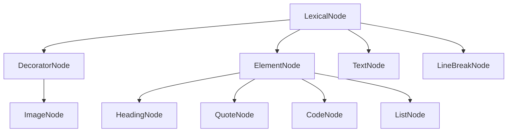
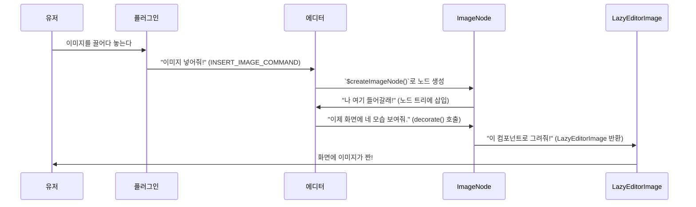

-----

# PostEditor 노드 시스템 깊게 파보기 ⛏️

## 시작하며

PostEditor가 어떻게 이미지나 코드 블록 같은 다양한 콘텐츠를 다룰 수 있을까요? 그냥 `div`에 `contentEditable` 속성만으로는 어림도 없죠. 그 비밀은 바로 Lexical 프레임워크의 심장과도 같은 **노드(Node) 시스템**에 있습니다.

노드는 에디터 안에 들어가는 모든 콘텐츠의 기본 단위예요. 텍스트 한 글자, 이미지, 목록 하나하나가 모두 각자의 규칙을 가진 '노드' 객체로 관리되죠. 이번 문서에서는 PostEditor가 어떻게 이 노드 시스템을 활용하고, 우리가 직접 만든 커스텀 노드는 어떤 원리로 돌아가는지 속속들이 파헤쳐 보겠습니다.

-----

## 목차

- [Lexical 노드, 일단 친해지기](https://www.google.com/search?q=%23lexical-%EB%85%B8%EB%93%9C-%EC%9D%BC%EB%8B%A8-%EC%B9%9C%ED%95%B4%EC%A7%80%EA%B8%B0)
- [그래서, 노드를 왜 써야 할까요?](https://www.google.com/search?q=%23%EA%B7%B8%EB%9E%98%EC%84%9C-%EB%85%B8%EB%93%9C%EB%A5%BC-%EC%99%9C-%EC%8D%A8%EC%95%BC-%ED%95%A0%EA%B9%8C%EC%9A%94)
- [PostEditor의 커스텀 노드 파헤치기](https://www.google.com/search?q=%23posteditor%EC%9D%98-%EC%BB%A4%EC%8A%A4%ED%85%80-%EB%85%B8%EB%93%9C-%ED%8C%8C%ED%97%A4%EC%B9%98%EA%B8%B0)
  - [1. ImageNode: 이미지 데이터의 설계도](https://www.google.com/search?q=%231-imagenode-%EC%9D%B4%EB%AF%B8%EC%A7%80-%EB%8D%B0%EC%9D%B4%ED%84%B0%EC%9D%98-%EC%84%A4%EA%B3%84%EB%8F%84)
  - [2. LazyEditorImage: 눈에 보이는 이미지 UI](https://www.google.com/search?q=%232-lazyeditorimage-%EB%88%88%EC%97%90-%EB%B3%B4%EC%9D%B4%EB%8A%94-%EC%9D%B4%EB%AF%B8%EC%A7%80-ui)
- [노드는 어떻게 태어나고 변할까요? (생명주기)](https://www.google.com/search?q=%23%EB%85%B8%EB%93%9C%EB%8A%94-%EC%96%B4%EB%96%BB%EA%B2%8C-%ED%83%9C%EC%96%B4%EB%82%98%EA%B3%A0-%EB%B3%80%ED%95%A0%EA%B9%8C%EC%9A%94-%EC%83%9D%EB%AA%85%EC%A3%BC%EA%B8%B0)
- [빠릿빠릿한 에디터를 위한 최적화 이야기](https://www.google.com/search?q=%23%EB%B9%A0%EB%A6%BF%EB%B9%A0%EB%A6%BF%ED%95%9C-%EC%97%90%EB%94%94%ED%84%B0%EB%A5%BC-%EC%9C%84%ED%95%9C-%EC%B5%9C%EC%A0%81%ED%99%94-%EC%9D%B4%EC%95%BC%EA%B8%B0)
- [새로운 기능 추가하기 (확장성)](https://www.google.com/search?q=%23%EC%83%88%EB%A1%9C%EC%9A%B4-%EA%B8%B0%EB%8A%A5-%EC%B6%94%EA%B0%80%ED%95%98%EA%B8%B0-%ED%99%95%EC%9E%A5%EC%84%B1)

-----

## 🔬 Lexical 노드, 일단 친해지기

### 노드의 핵심, '불변성'

Lexical의 모든 노드는 **불변(Immutable) 객체**예요. 이게 왜 중요할까요? 한 번 만들어진 노드는 직접 수정하는 게 아니라, 항상 '복사본'을 만들어 변경하기 때문에 상태 관리가 훨씬 쉬워지고 버그가 줄어들어요. React가 state를 다루는 방식과 비슷하죠.

```typescript
// 노드를 바꾸고 싶을 땐?
const node = new ImageNode(src, altText, maxWidth);
const updatedNode = node.getWritable(); // 쓰기 가능한 복사본을 만들고
updatedNode.__width = newWidth;         // 복사본의 값을 변경!
```

### 노드들의 가계도

Lexical에는 여러 종류의 노드가 있고, 각자 역할이 정해져 있어요.



**노드 종류별 한 줄 요약:**

| 노드 타입 | 설명 | 예시 |
| :--- | :--- | :--- |
| **DecoratorNode** | 이미지나 비디오처럼 UI를 직접 그리는 특별한 노드예요. (React 컴포넌트 사용) | ImageNode, VideoNode |
| **ElementNode** | 다른 노드들을 자식으로 품을 수 있는 컨테이너 노드예요. | 문단(p), 제목(h1), 목록(ul) |
| **TextNode** | 말 그대로 글자를 담는 가장 기본적인 노드예요. | "안녕하세요" 같은 일반 텍스트 |
| **LineBreakNode** | 엔터(줄바꿈)를 표현하는 노드예요. | `\n` |

-----

## 🤔 그래서, 노드를 왜 써야 할까요?

그냥 HTML로 하면 편할 텐데, 왜 굳이 복잡해 보이는 노드 시스템을 쓸까요? 몇 가지 결정적인 이유가 있어요.

### 1\. 안전하고 체계적인 콘텐츠 관리

단순히 `innerHTML`을 사용하면 온갖 종류의 HTML 태그가 섞여 들어와 통제 불능이 될 수 있어요. 하지만 노드 시스템을 쓰면 우리가 허용한 콘텐츠만, 정해진 구조대로 들어오게 할 수 있죠.

```typescript
// ❌ HTML 기반: 무슨 태그가 들어올지 몰라 불안해요.
const content = '';

// ✅ 노드 기반: 정해진 타입과 값만 허용해서 안전해요.
const imageNode = $createImageNode({
  src: string,
  altText: string,
  maxWidth: number
});
```

### 2\. 데이터를 깔끔하게 저장하고 불러오기

노드는 완벽하게 JSON 형태로 변환(직렬화)할 수 있어요. 덕분에 에디터의 상태를 데이터베이스에 저장하고, 다시 불러와서 원래 모습 그대로 복원하는 게 아주 쉬워요.

```typescript
// 직렬화 (DB에 저장할 때)
const serialized = imageNode.exportJSON();
// { type: 'image', src: '...', altText: '...', ... }

// 역직렬화 (DB에서 불러올 때)
const restoredNode = ImageNode.importJSON(serialized);
```

### 3\. 기능 하나하나를 내 마음대로

각 노드마다 고유한 기능과 동작을 직접 정의할 수 있어요. 예를 들어, 이미지 노드는 복사/붙여넣기 할 때 `` 태그로 변환하고, 에디터 안에서는 크기 조절이 가능한 React 컴포넌트로 보이게 만드는 식이죠.

```typescript
class ImageNode extends DecoratorNode<JSX.Element> {
  // DOM을 어떻게 만들지?
  createDOM(config: EditorConfig): HTMLElement { ... }
  
  // DOM 업데이트는 어떻게 할까? (최적화)
  updateDOM(): boolean { ... }
  
  // 어떤 React 컴포넌트를 보여줄까?
  decorate(): JSX.Element { ... }
  
  // 복사/붙여넣기는 어떻게 처리할까?
  static importDOM(): DOMConversionMap { ... }
}
```

### 4\. 똑똑한 렌더링으로 성능 잡기

Lexical은 변경된 노드만 콕 집어서 다시 그리기 때문에 아주 긴 글에서도 성능이 좋아요. 전체를 다시 렌더링하는 것보다 훨씬 효율적이죠.

-----

## 🛠️ PostEditor의 커스텀 노드 파헤치기

PostEditor에서는 기본 노드 외에 우리가 직접 만든 커스텀 노드를 사용해요. 대표적인 `ImageNode`를 통해 노드가 실제로 어떻게 동작하는지 살펴볼게요.

### 1\. ImageNode: 이미지 데이터의 설계도

**파일**: `ImageNode.tsx`
**역할**: 이미지에 대한 모든 정보(URL, 대체 텍스트, 크기 등)를 가지고 있고, 에디터가 이해할 수 있도록 하는 데이터 객체(설계도) 역할.

#### 뼈대 살펴보기

```typescript
export class ImageNode extends DecoratorNode<JSX.Element> {
  // 이미지의 상태를 저장하는 속성들
  __src: string;          // 이미지 주소
  __altText: string;      // 대체 텍스트
  __width: 'inherit' | number;   // 너비
  __height: 'inherit' | number;  // 높이
  __maxWidth: number;     // 최대 너비
```

**잠깐, 왜 이름 앞에 밑줄 두 개(`__`)가 붙을까요?**
이건 Lexical의 약속(컨벤션)이에요. "이건 노드의 핵심 상태 값이니까 외부에서 함부로 바꾸지 말고, 정해진 메서드를 통해 다뤄주세요\!"라는 의미죠. 노드의 불변성을 지키기 위한 장치이기도 해요.

#### 주요 기능 뜯어보기

**1. 노드를 만드는 방법 (`constructor`와 `팩토리 함수`)**

노드를 생성할 때는 `new ImageNode(...)` 보다 `$createImageNode(...)` 라는 팩토리 함수를 사용하는 게 더 편하고 안전해요. 기본값을 설정해주거나 추가적인 로직을 넣기 좋거든요.

```typescript
// 팩토리 함수: 노드를 좀 더 편하게 만들게 도와줘요.
export const $createImageNode = ({...}: ImagePayload) => {
  return new ImageNode(...);
};
```

**2. 저장하고 불러오는 방법 (`exportJSON` / `importJSON`)**

위에서 봤던 직렬화/역직렬화를 담당하는 메서드예요. DB에 저장할 형식과 DB에서 읽어온 데이터를 노드로 변환하는 규칙을 정의하죠.

```typescript
// JSON으로 내보내기 (DB 저장용)
exportJSON(): SerializedImageNode { ... }

// JSON에서 가져오기 (DB 복원용)
static importJSON(serializedNode: SerializedImageNode): ImageNode { ... }
```

**3. HTML과 소통하는 방법 (`importDOM` / `exportDOM`)**

외부에서 `` 태그를 복사해서 붙여넣었을 때, 이걸 `ImageNode`로 변환하는 규칙(`importDOM`)과, 에디터 내용을 HTML로 내보낼 때 `ImageNode`를 `` 태그로 바꾸는 규칙(`exportDOM`)을 정해요.

```typescript
// HTML 태그를 ImageNode로 변환 (붙여넣기)
static importDOM(): DOMConversionMap | null { ... }

// ImageNode를 HTML 태그로 변환 (내보내기)
exportDOM(): DOMExportOutput { ... }
```

**4. 화면에 그리는 방법 (`decorate`)**

이게 바로 `DecoratorNode`의 꽃이에요\! 데이터를 가진 노드가 실제 화면에 어떤 모습으로 보일지를 정하죠. 여기서는 `LazyEditorImage`라는 React 컴포넌트를 뿅 하고 보여주라고 지정했네요.

```typescript
// 이 노드는 이 React 컴포넌트로 그려주세요!
decorate(): JSX.Element {
  return (
    <Suspense fallback={null}>
      <LazyEditorImage ... />
    </Suspense>
  );
}
```

**5. DOM 뼈대 만들기 (`createDOM` / `updateDOM`)**

React 컴포넌트를 감쌀 기본적인 DOM 태그(`<span>` 등)를 만들어요. `updateDOM`이 `false`인 이유는, 세부적인 렌더링은 React(`LazyEditorImage`)가 알아서 할 테니 Lexical은 신경 쓰지 말라는 의미예요. "여긴 React 구역이니 DOM 업데이트는 우리가 할게\!" 하는 거죠.

#### ImageNode, 한눈에 보기

* **장점**: 타입이 명확하고, DB 저장/복원이 쉽고, HTML과도 잘 호환돼요.
* **단점**: 간단한 이미지 하나 보여주자고 만드는 코드가 좀 길고 복잡하죠.

-----

### 2\. LazyEditorImage: 눈에 보이는 이미지 UI

**파일**: `LazyEditorImage.tsx`  
**역할**: `ImageNode`가 가진 데이터를 바탕으로 실제 유저 눈에 보이는 UI를 그리고, 이미지 선택이나 삭제 같은 상호작용을 처리해요.

`ImageNode`가 데이터와 뼈대라면, `LazyEditorImage`는 실제 우리 눈에 보이는 예쁜 옷과 같아요.

#### 어떤 기능들이 들어있을까요?

**1. 이미지 선택 상태 관리**

Lexical이 제공하는 `useLexicalNodeSelection` 훅을 사용해서 이미지가 선택되었는지 아닌지를 쉽게 관리할 수 있어요.

```typescript
// 이 훅 하나로 선택 여부, 선택하기, 선택 해제하기 기능을 다 쓸 수 있어요.
const [isSelected, setSelected, clearSelection] = useLexicalNodeSelection(nodeKey);
const isFocused = isSelected && isEditable;
```

**2. 이미지 삭제하기**

이미지가 선택된 상태에서 `Backspace`나 `Delete` 키를 누르면 `deleteImage` 함수가 실행되어 해당 노드를 에디터에서 삭제해요.

```typescript
const deleteImage = useCallback((payload: KeyboardEvent) => {
    // ...
    if ($isImageNode(node)) {
      node.remove(); // 노드를 트리에서 제거!
    }
    // ...
}, [editor, isSelected]);
```

**3. 다양한 커맨드 등록하기**

`useEffect` 안에서 `editor.registerCommand`를 사용해 특정 이벤트(클릭, 키보드 입력 등)가 발생했을 때 어떤 함수를 실행할지 등록해요. `mergeRegister`는 여러 커맨드를 등록하고 한 번에 정리할 수 있게 도와주는 유틸리티 함수예요.

```typescript
useEffect(() => {
  // 컴포넌트가 생길 때 CLICK, KEY_DELETE 커맨드를 등록해요.
  const unregister = mergeRegister(
    editor.registerCommand(CLICK_COMMAND, onClick, ...),
    editor.registerCommand(KEY_DELETE_COMMAND, deleteImage, ...),
    // ...
  );

  // 컴포넌트가 사라질 때 등록했던 커맨드를 깨끗하게 정리해요.
  return () => unregister();
}, [editor]);
```

**4. UI 그리기**

실제 이미지는 `LazyImage` 컴포넌트를 통해 그리고, 선택되었을 때(`isFocused`)는 추가적인 UI(예: "삭제하려면 backspace를 누르세요" 같은 안내 메시지)를 보여줘요.

```typescript
return (
  // ...
  <div>
    {/* 선택됐을 때만 보이는 안내 메시지 */}
    {isFocused && (
      <div>backspace 또는 del 키를 통해 삭제</div>
    )}
    
    {/* 실제 이미지를 보여주는 컴포넌트 */}
    <LazyImage ... className={isFocused ? 'focused' : undefined} />
  </div>
  // ...
);
```

#### LazyEditorImage의 특징

* **최적화**: 이미지가 화면에 보일 때만 로딩(`Lazy Loading`)하고, 불필요한 함수 생성을 막기 위해 `useCallback`을 사용해요.
* **사용자 경험(UX)**: 이미지를 선택하면 테두리로 시각적 피드백을 주고, 키보드로 쉽게 삭제할 수 있게 만들어 사용자가 편하게 쓸 수 있어요.

-----

## 🔄 노드는 어떻게 태어나고 변할까요? (생명주기)

### 1\. 이미지 노드가 만들어지는 과정



### 2\. 노드 정보가 바뀌는 과정 (e.g. 크기 조절)

불변성 원칙에 따라, 노드를 직접 바꾸는 게 아니라 복사본을 만들어 수정해요.

```typescript
// 1. 유저가 이미지 크기를 조절하면
editor.update(() => {
  const node = $getNodeByKey(imageNodeKey);
  
  // 2. 쓰기 가능한 복사본을 만들어서
  const writableNode = node.getWritable();
  
  // 3. 복사본의 값을 바꿔치기해요.
  writableNode.setWidthAndHeight(newWidth, newHeight);
  
  // 4. 그럼 Lexical이 알아서 화면을 다시 그려줘요.
});
```

-----

## ⚡️ 빠릿빠릿한 에디터를 위한 최적화 이야기

### 1\. 메모리 사용량 줄이기

**지연 로딩 (Lazy Loading)**
`LazyImage` 컴포넌트는 React.lazy를 사용해서 만들었어요. 덕분에 당장 화면에 보이지 않는 이미지는 로드하지 않아 초기 로딩 속도가 빨라지죠.

```typescript
// LazyImage 컴포넌트는 필요할 때만 불러와요.
const LazyImage = lazy(() => import('@/components/commons/LazyImage'));

<Suspense fallback={null}>
  <LazyImage src={src} />
</Suspense>
```

### 2\. 렌더링 속도 올리기

**똑똑한 UI 렌더링**
이미지가 선택되었을 때만 컨트롤 UI가 보이도록 해서 불필요한 렌더링을 피해요.

```typescript
{isFocused && ( <div className="image-controls">...</div> )}
```

**똑똑한 이벤트 핸들러**
`useCallback`을 사용해 `isSelected` 같은 상태가 변경될 때만 `onClick` 함수를 새로 만들도록 해서 렌더링 성능을 아낄 수 있어요.

-----

## 🧩 새로운 기능 추가하기 (확장성)

PostEditor의 노드 시스템은 새로운 기능을 붙이기에 아주 좋은 구조예요. 만약 '비디오' 노드를 추가하고 싶다면 어떻게 해야 할까요?

1.  비디오 정보를 담을 `VideoNode` 클래스를 만들고,
2.  화면에 보여줄 `VideoPlayer` React 컴포넌트를 만들고,
3.  `VideoNode`의 `decorate` 메서드가 `VideoPlayer`를 반환하게 연결해주면 끝\!

여기에 "비디오 추가" 커맨드와 그 커맨드를 처리하는 플러그인까지 만들면 새로운 기능을 완벽하게 추가할 수 있죠.

-----

## 👍👎 노드 시스템의 장단점

### ✅ 좋은 점

1.  **안전성**: 타입스크립트 덕분에 타입 관련 버그가 거의 없어요.
2.  **체계성**: 모든 콘텐츠가 정해진 구조를 가져서 데이터를 다루기 편해요.
3.  **데이터 관리**: DB에 저장하고 불러오기가 아주 깔끔해요.
4.  **확장성**: 비디오, 투표, 지도 등 새로운 기능을 추가하기 쉬워요.
5.  **성능**: 똑똑한 렌더링 덕분에 긴 글에서도 빠릿빠릿해요.

### ⚠️ 아쉬운 점

1.  **배워야 할 게 좀 있어요**: Lexical의 노드 시스템에 익숙해지는 데 시간이 필요해요.
2.  **코드가 길어져요**: 간단한 기능 하나를 추가하려 해도 여러 파일을 만들어야 해서 코드가 복잡해 보일 수 있어요.
3.  **디버깅**: 눈에 보이는 HTML과 실제 데이터 구조(노드 트리)가 달라서 디버깅이 조금 더 까다로울 수 있어요.

-----

## 마무리하며

PostEditor의 노드 시스템은 처음엔 복잡해 보일 수 있지만, 그 구조를 이해하고 나면 **안정적이고 확장성 높은 에디터**를 만드는 데 이보다 더 좋은 방법은 없다는 걸 알게 됩니다.

- **불변성**으로 데이터 흐름을 예측 가능하게 만들고,
- 데이터(**Node**)와 화면(**Component**)의 **역할을 명확히 분리**해서 코드를 깔끔하게 유지하고,
- **최적화 기법**들을 녹여내어 좋은 성능을 보장하죠.

이런 탄탄한 설계 덕분에 PostEditor는 앞으로 더 복잡하고 다양한 기능들을 안정적으로 품을 수 있는 훌륭한 기반을 갖추게 되었습니다.