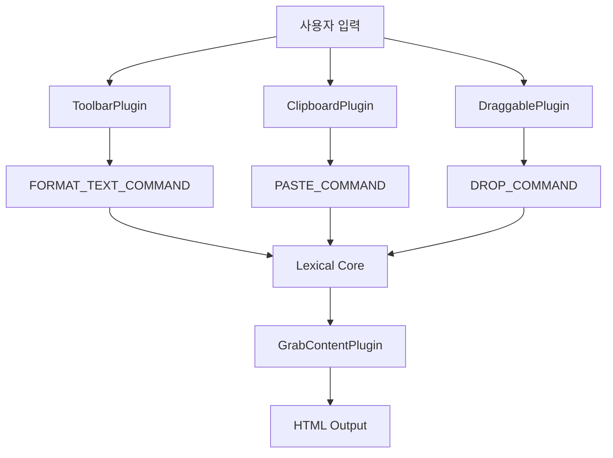

-----

# PostEditor 플러그인 탐험기 🗺️

## 시작하며

PostEditor가 글꼴을 바꾸고, 이미지를 끌어다 놓고, 마크다운을 뿅 하고 변환하는 등 마법 같은 일들을 해내는 비결은 무엇일까요? 바로 **플러그인(Plugin) 시스템** 덕분입니다.

PostEditor는 12개의 전문 플러그인들이 레고 블록처럼 각자 맡은 역할을 수행하고, 서로 유기적으로 협력해서 만들어진 결과물이에요. 이번 문서에서는 에디터의 핵심 기능을 담당하는 플러그인들이 각각 어떤 역할을 하고, 내부적으로 어떻게 똑똑하게 작동하는지 함께 탐험해 보겠습니다.

-----

## 목차

- [플러그인은 어떻게 작동할까? (아키텍처)](https://www.google.com/search?q=%23%ED%94%8C%EB%9F%AC%EA%B7%B8%EC%9D%B8%EC%9D%80-%EC%96%B4%EB%96%BB%EA%B2%8C-%EC%9E%91%EB%8F%99%ED%95%A0%EA%B9%8C-%EC%95%84%ED%82%A4%ED%85%8D%EC%B2%98)
- [핵심 플러그인 톺아보기](https://www.google.com/search?q=%23%ED%95%B5%EC%8B%AC-%ED%94%8C%EB%9F%AC%EA%B7%B8%EC%9D%B8-%ED%86%BA%EC%95%84%EB%B3%B4%EA%B8%B0)
  - [1. ToolbarPlugin: 에디터의 얼굴](https://www.google.com/search?q=%231-toolbarplugin-%EC%97%90%EB%94%94%ED%84%B0%EC%9D%98-%EC%96%BC%EA%B5%B4)
  - [2. CodeActionPlugin: 개발자를 위한 작은 배려](https://www.google.com/search?q=%232-codeactionplugin-%EA%B0%9C%EB%B0%9C%EC%9E%90%EB%A5%BC-%EC%9C%84%ED%95%9C-%EC%9E%91%EC%9D%80-%EB%B0%B0%EB%A0%A4)
  - [3. FloatingLinkEditorPlugin: 똑똑한 링크 편집기](https://www.google.com/search?q=%233-floatinglinkeditorplugin-%EB%98%91%EB%98%91%ED%95%9C-%EB%A7%81%ED%81%AC-%ED%8E%B8%EC%A7%91%EA%B8%B0)
  - [4. ImagePlugin: 이미지 삽입의 해결사](https://www.google.com/search?q=%234-imageplugin-%EC%9D%B4%EB%AF%B8%EC%A7%80-%EC%82%BD%EC%9E%85%EC%9D%98-%ED%95%B4%EA%B2%B0%EC%82%AC)
  - [5. DraggablePlugin: 블록을 자유롭게 이동](https://www.google.com/search?q=%235-draggableplugin-%EB%B8%94%EB%A1%9D%EC%9D%84-%EC%9E%90%EC%9C%A0%EB%A1%AD%EA%B2%8C-%EC%9D%B4%EB%8F%99)
  - [6. ClipboardPlugin: 스마트한 복사/붙여넣기](https://www.google.com/search?q=%236-clipboardplugin-%EC%8A%A4%EB%A7%88%ED%8A%B8%ED%95%9C-%EB%B3%B5%EC%82%AC%EB%B6%99%EC%97%AC%EB%84%A3%EA%B8%B0)
  - [7. GrabContentPlugin: 실시간 내용 전달자](https://www.google.com/search?q=%237-grabcontentplugin-%EC%8B%A4%EC%8B%9C%EA%B0%84-%EB%82%B4%EC%9A%A9-%EC%A0%84%EB%8B%AC%EC%9E%90)
  - [8. HighlightCodePlugin: 코드를 아름답게](https://www.google.com/search?q=%238-highlightcodeplugin-%EC%BD%94%EB%93%9C%EB%A5%BC-%EC%95%84%EB%A6%84%EB%8B%B5%EA%B2%8C)
  - [9. InitContentPlugin: 저장된 글 불러오기](https://www.google.com/search?q=%239-initcontentplugin-%EC%A0%80%EC%9E%A5%EB%90%9C-%EA%B8%80-%EB%B6%88%EB%9F%AC%EC%98%A4%EA%B8%B0)
  - [10. MaxIndentPlugin: 들여쓰기 경찰](https://www.google.com/search?q=%2310-maxindentplugin-%EB%93%A4%EC%97%AC%EC%93%B0%EA%B8%B0-%EA%B2%BD%EC%B0%B0)
  - [11. MarkdownShortcuts: 마크다운 마법사](https://www.google.com/search?q=%2311-markdownshortcuts-%EB%A7%88%ED%81%AC%EB%8B%A4%EC%9A%B4-%EB%A7%88%EB%B2%95%EC%82%AC)
  - [12. Utils: 우리들의 연장통](https://www.google.com/search?q=%2312-utils-%EC%9A%B0%EB%A6%AC%EB%93%A4%EC%9D%98-%EC%97%B0%EC%9E%A5%ED%86%B5)
- [플러그인들은 어떻게 협업할까?](https://www.google.com/search?q=%23%ED%94%8C%EB%9F%AC%EA%B7%B8%EC%9D%B8%EB%93%A4%EC%9D%80-%EC%96%B4%EB%96%BB%EA%B2%8C-%ED%98%91%EC%97%85%ED%95%A0%EA%B9%8C)
- [빠릿한 에디터를 만드는 비결](https://www.google.com/search?q=%23%EB%B9%A0%EB%A6%BF%ED%95%9C-%EC%97%90%EB%94%94%ED%84%B0%EB%A5%BC-%EB%A7%8C%EB%93%9C%EB%8A%94-%EB%B9%84%EA%B2%B0)

-----

## 🤔 플러그인은 어떻게 작동할까? (아키텍처)

### 중앙 소통 채널, '커맨드 시스템'

플러그인들은 서로를 직접 호출하지 않아요. 대신 Lexical의 **커맨드 시스템**이라는 중앙 소통 채널을 통해 "나 이런 일 좀 해줘\!" 하고 요청(dispatch)하거나, "이런 요청이 오면 내가 처리할게\!" 하고 등록(register)하는 방식으로 동작해요. 덕분에 각 플러그인은 독립성을 유지하면서도 서로 협력할 수 있죠.

```typescript
// 이런 패턴으로 커맨드를 등록해요
editor.registerCommand(
  COMMAND_TYPE,           // 어떤 종류의 요청인지 (예: FORMAT_TEXT_COMMAND)
  commandHandler,         // 요청이 오면 실행할 함수
  COMMAND_PRIORITY_LEVEL  // "내가 먼저 처리할래!" (우선순위)
);
```

### 플러그인의 삶 (생명주기)

대부분의 플러그인은 `useEffect`를 이용해 에디터가 처음 생길 때 필요한 기능을 등록하고, 사라질 때 깨끗하게 정리하는 간단한 구조를 가져요.

```typescript
export const MyPlugin = () => {
  const [editor] = useLexicalComposerContext();
  
  useEffect(() => {
    // 1. 플러그인이 태어날 때
    // 2. "이런 커맨드 오면 나한테 알려줘!" 하고 등록
    const cleanup = editor.registerCommand(...);
    
    // 3. 플러그인이 죽을 때 등록했던 걸 해제 (메모리 누수 방지!)
    return cleanup;
  }, [editor]);
  
  return null; // 보통 UI는 없어요
};
```

-----

## 🚀 핵심 플러그인 톺아보기

### 1\. ToolbarPlugin: 에디터의 얼굴

**파일**: `ToolbarPlugin.tsx`  
**역할**: 우리 눈에 가장 잘 보이는 상단 툴바예요. 글자 스타일을 바꾸는 모든 버튼과 드롭다운의 로직을 담당하죠.

#### 어떻게 작동하나요?

**1. 현재 텍스트 상태 추적하기**
유저가 드래그해서 선택한 영역의 텍스트가 굵게(bold)인지, 기울임(italic)인지 등을 실시간으로 감지해서 툴바 버튼의 활성화 상태를 바꿔줘요.

```typescript
const updateToolbarOnSelect = useCallback(() => {
  const selection = $getSelection();
  if ($isRangeSelection(selection)) {
    // 선택 영역이 'bold' 포맷을 가졌는지 확인
    setIsBold(selection.hasFormat('bold'));
    // ... 다른 포맷들도 확인
  }
}, []);
```

**2. 상태 변화 감지하고 툴바 업데이트하기**
`SELECTION_CHANGE_COMMAND`와 `registerUpdateListener`를 이용해 유저의 선택 영역이 바뀌거나 글자 내용이 바뀔 때마다 `updateToolbarOnSelect` 함수를 호출해서 툴바 UI를 최신 상태로 유지해요.

```typescript
useEffect(() => {
  return mergeRegister(
    // 선택 영역이 바뀔 때마다 알려줘!
    editor.registerCommand(
      SELECTION_CHANGE_COMMAND,
      () => { updateToolbarOnSelect(); return false; },
      COMMAND_PRIORITY_CRITICAL
    ),
    // 에디터 내용이 바뀔 때마다 알려줘!
    editor.registerUpdateListener(...)
  );
}, [editor, updateToolbarOnSelect]);
```

> `useCallback`으로 함수를 감싸서 불필요한 리렌더링을 막는 건 성능을 위한 기본 센스\!

**3. 텍스트 스타일 적용하기**
유저가 '굵게' 버튼을 누르면, `FORMAT_TEXT_COMMAND`를 에디터에 보내 "선택된 영역을 굵게 만들어줘\!" 하고 요청해요.

```typescript
const formatText = (format: TextFormatType) => {
  editor.dispatchCommand(FORMAT_TEXT_COMMAND, format);
};

<button onClick={() => formatText('bold')}>굵게</button>
```

-----

### 2\. CodeActionPlugin: 개발자를 위한 작은 배려

**파일**: `CodeActionPlugin.tsx`  
**역할**: 코드 블록 위에 마우스를 올리면 오른쪽 위에 '언어 이름'과 '복사' 버튼이 스르륵 나타나게 해줘요.

#### 어떻게 작동하나요?

**1. 똑똑한 이벤트 처리, 디바운싱(Debounce)**
마우스를 1px만 움직여도 `mousemove` 이벤트는 수십 번씩 발생해요. 이걸 그대로 다 처리하면 성능이 나빠지겠죠? 그래서 **디바운싱**을 사용해 마우스 움직임이 "잠깐 멈췄을 때" 한 번만 위치 계산 로직을 실행하도록 만들었어요.

```typescript
// 커스텀 디바운스 훅을 사용
const debouncedOnMouseMove = useDebounce(
  (event: MouseEvent) => {
    // 마우스 위치 계산 및 UI 표시 로직...
  },
  50,  // 50ms 동안 추가 움직임이 없으면 실행
  1000 // 아무리 길어도 1초에 한 번은 실행
);
```

**2. 필요할 때만 이벤트 듣기**
에디터에 코드 블록이 하나도 없다면 마우스 움직임을 감시할 필요가 없겠죠? `registerMutationListener`로 `CodeNode`의 생성/삭제를 감지해서, 코드 블록이 있을 때만 마우스 이벤트를 활성화해요. 똑똑한 최적화죠.

```typescript
useEffect(() => {
  return editor.registerMutationListener(CodeNode, (mutations) => {
      // ... 코드 노드 개수 추적
      // 코드 블록이 하나라도 있으면 true, 없으면 false
      setShouldListenMouseMove(codeSetRef.current.size > 0);
    });
}, [editor]);
```

**3. 코드 복사하기**
복사 버튼을 누르면 현재 마우스가 올라간 코드 블록의 텍스트 전체를 `navigator.clipboard.writeText`를 이용해 클립보드에 복사해줘요.

-----

### 3\. FloatingLinkEditorPlugin: 똑똑한 링크 편집기

**파일**: `FloatingLinkEditorPlugin.tsx`  
**역할**: 링크가 걸린 텍스트를 클릭하면 그 주변에 작은 창(플로팅 에디터)을 띄워서 링크를 바로 수정하거나 삭제할 수 있게 해줘요.

#### 어떻게 작동하나요?

**1. 링크 상태 감지 및 위치 계산**
`updateToolbar` 함수는 현재 선택된 텍스트가 링크인지 아닌지를 판단하고, `updateLinkEditor` 함수는 선택된 텍스트의 화면상 좌표를 계산해서 플로팅 에디터가 어디에 나타나야 할지 정해요.

```typescript
const updateLinkEditor = useCallback(() => {
  const selection = $getSelection();
  if (...) {
    // 선택 영역의 DOM 위치를 가져와서
    const domRect = nativeSelection.focusNode?.parentElement?.getBoundingClientRect();
    if (domRect) {
      // 플로팅 UI 위치를 계산하고 업데이트!
      setFloatingElemPositionForLinkEditor(...);
    }
  }
}, [editor, ...]);
```

**2. URL 자동 감지 및 생성**
이 플러그인의 숨겨진 꿀 기능\! 텍스트를 선택한 상태에서 유효한 URL(`https://...`)을 붙여넣으면, 자동으로 그 텍스트에 링크를 걸어줘요.

-----

### 4\. ImagePlugin: 이미지 삽입의 해결사

**파일**: `ImagePlugin.tsx`  
**역할**: `INSERT_IMAGE_COMMAND`라는 명령어를 받아서, 에디터에 실제 `ImageNode`를 삽입하는 단순하지만 중요한 역할을 해요.

#### 어떻게 작동하나요?

이 플러그인은 딱 한 가지 일만 해요. `INSERT_IMAGE_COMMAND` 요청이 오면 페이로드로 받은 이미지 정보(`src`, `altText` 등)를 이용해 `$createImageNode` 함수로 이미지 노드를 만들고, `$insertNodes`로 에디터에 삽입하죠.

```typescript
editor.registerCommand<InsertImagePayload>(
  INSERT_IMAGE_COMMAND,
  (payload) => {
    // 1. 페이로드로 이미지 노드 생성
    const imgNode = $createImageNode(payload);
    // 2. 에디터에 노드 삽입
    $insertNodes([imgNode]);
    
    // 3. 이미지가 최상단에 덩그러니 있으면 문단(p)으로 감싸주는 센스!
    if ($isRootOrShadowRoot(imgNode.getParentOrThrow())) {
      $wrapNodeInElement(imgNode, $createParagraphNode).selectEnd();
    }

    return true;
  },
  COMMAND_PRIORITY_EDITOR
)
```

-----

### 5\. DraggablePlugin: 블록을 자유롭게 이동

**파일**: `DraggablePlugin.tsx`  
**역할**: 문단, 이미지, 코드 블록 등 각 콘텐츠 블록을 마우스로 끌어서 순서를 바꿀 수 있게 해줘요.

#### 어떻게 작동하나요? (핵심만\!)

**1. 빠른 블록 탐색 (이진 탐색)**
마우스가 어떤 블록 위에 있는지 찾기 위해 모든 블록을 하나씩 다 검사하면 비효율적이겠죠? 그래서 **이진 탐색(Binary Search)** 알고리즘을 사용해서 아주 빠르게(시간 복잡도 O(log n)) 해당 블록을 찾아내요.

**2. 드래그 앤 드롭 로직**
드래그가 시작되면(`onDragStart`) 어떤 노드가 끌리고 있는지 기록하고, 다른 블록 위로 지나갈 때(`onDragOver`)는 어디에 놓을 수 있는지 시각적으로 선을 보여줘요. 마지막으로 마우스를 놓으면(`onDrop`) 기록해둔 노드를 해당 위치로 실제로 이동시켜요.

**3. 시각적 피드백**
유저가 블록을 끌고 다른 블록 위를 지날 때, 블록의 위 또는 아래에 파란 선을 그려줘서 "여기에 놓을 수 있어요\!"라고 알려줘요. 사용자 경험을 높이는 중요한 디테일이죠.

-----

### 6\. ClipboardPlugin: 스마트한 복사/붙여넣기

**파일**: `ClipboardPlugin.ts`  
**역할**: 단순한 텍스트 복붙을 넘어, 코드 조각을 자동으로 감지하고, Lexical 에디터 간에는 서식까지 완벽하게 복사해주는 똑똑한 클립보드예요.

#### 어떻게 작동하나요?

**1. 코드 자동 감지**
일반 텍스트를 붙여넣을 때, 내용에 `function`, `const` 같은 키워드가 많거나 들여쓰기가 많으면 "어, 이거 코드 같은데?" 하고 추측해요.

```typescript
const looksLikeCode = (text: string): boolean => {
  // ... 키워드 개수, 들여쓰기 비율 등을 바탕으로 휴리스틱 분석
  return (keywordCnt > 0 && indentCnt >= lines.length / 4 && ...);
};
```

코드로 판단되면, Prism.js를 이용해 어떤 프로그래밍 언어인지까지 분석해서 자동으로 코드 블록을 만들어줘요. 정말 편리하죠\!

**2. 풍부한 클립보드 데이터**
에디터 내용을 복사할 때, 클립보드에 여러 형식의 데이터를 한꺼번에 저장해요.

1.  **Lexical 내부 형식**: 다른 Lexical 에디터에 붙여넣을 때 서식을 완벽하게 유지해요.
2.  **HTML 형식**: Notion이나 다른 웹 에디터에 붙여넣어도 스타일이 어느 정도 유지돼요.
3.  **일반 텍스트 형식**: 메모장 같은 곳에 붙여넣을 때를 대비해요.

**3. 붙여넣기 우선순위 처리**
붙여넣기를 할 때는 위 데이터 형식을 역순으로 확인해서 가장 풍부한 정보를 가진 데이터부터 처리하려고 시도해요.

-----

### 7\. GrabContentPlugin: 실시간 내용 전달자

**파일**: `GrabContentPlugin.tsx`  
**역할**: 에디터 내용이 바뀔 때마다 그 내용을 실시간으로 HTML 문자열로 변환해서 부모 컴포넌트(`PostEditor`)로 전달하는 '보고' 역할을 해요.

#### 어떻게 작동하나요?

`editor.registerUpdateListener`를 사용해 에디터에 작은 변화라도 생길 때마다 콜백 함수가 실행되게 해요. 콜백 안에서는 `$generateHtmlFromNodes` 유틸리티를 사용해 현재 에디터 상태를 HTML로 변환하고, 그 결과를 `forwardContent` prop으로 쏴주죠.

-----

### 8\. HighlightCodePlugin: 코드를 아름답게

**파일**: `HighlightCodePlugin.ts`  
**역할**: 코드 블록 안의 코드를 언어 문법에 맞게 예쁘게 색칠(하이라이팅)해줘요.

#### 어떻게 작동하나요?

이 플러그인은 Lexical이 기본으로 제공하는 `registerCodeHighlighting` 함수를 호출해주는 역할만 해요. 실제 하이라이팅 로직은 Lexical과 Prism.js가 알아서 처리하죠.

-----

### 9\. InitContentPlugin: 저장된 글 불러오기

**파일**: `InitContentPlugin.tsx`  
**역할**: '수정하기' 페이지처럼 기존에 저장된 글(HTML)이 있을 때, 에디터가 처음 로딩될 때 그 내용을 채워 넣어요.

#### 어떻게 작동하나요?

`content` prop으로 받은 HTML 문자열을 `parseHtmlStrToLexicalNodes` 유틸리티 함수로 Lexical 노드들로 변환한 다음, `$getRoot().clear().select()`로 에디터를 깨끗이 비우고 변환된 노드들을 삽입해요. `initialized` 상태를 둬서 이 작업이 딱 한 번만 실행되도록 보장하죠.

-----

### 10\. MaxIndentPlugin: 들여쓰기 경찰

**파일**: `MaxIndentPlugin.tsx`  
**역할**: 목록(리스트)에서 너무 깊게 들여쓰기(indent)하는 것을 막아줘요. (기본 6단계)

#### 어떻게 작동하나요?

`INDENT_CONTENT_COMMAND`를 \*\*가장 높은 우선순위(`CRITICAL`)\*\*로 가로채요. 그리고 현재 선택된 목록의 깊이를 계산해서, 만약 최대 깊이를 넘으려고 하면 `true`를 반환해서 "이 명령은 무시해\!"라고 알려주죠.

-----

### 11\. MarkdownShortcuts: 마크다운 마법사

**파일**: `markdownShortcuts.ts`  
**역할**: `#`을 입력하면 `h1` 태그로, `**текст**`를 입력하면 굵은 글씨로 바꿔주는 등 익숙한 마크다운 문법을 실시간으로 변환해줘요.

#### 어떻게 작동하나요?

Lexical이 제공하는 `@lexical/react/LexicalMarkdownShortcutPlugin`을 사용해요. 우리는 어떤 문법(`regExp`)을 어떤 노드로 바꿀지(`replace`)에 대한 규칙(Transformer) 목록만 정의해주면 돼요. 리스트(` *  `)나 코드 블록(\`\`\`\`\`\`)처럼 여러 줄에 걸쳐 있거나 주변 노드와 합쳐져야 하는 복잡한 규칙들도 깔끔하게 처리해요.

-----

### 12\. Utils: 우리들의 연장통

**파일**: `utils.ts`  
**역할**: 여러 플러그인에서 공통으로 사용하는 함수들을 모아놓은 유틸리티 파일이에요. 대표적으로 `parseHtmlStrToLexicalNodes`가 있죠.

-----

## 🤝 플러그인들은 어떻게 협업할까?

### 데이터 흐름

유저의 입력은 각자 전문 분야의 플러그인에 의해 처리되고, 커맨드 시스템을 통해 에디터의 핵심 로직으로 전달돼요. 그리고 그 결과는 다시 `GrabContentPlugin`을 통해 외부로 전달되죠.



### 커맨드 우선순위의 중요성

붙여넣기(`PASTE_COMMAND`)처럼 여러 플러그인이 처리하고 싶어 하는 커맨드의 경우, 우선순위가 중요해요. `ClipboardPlugin`은 `CRITICAL` 우선순위로 먼저 붙여넣기 이벤트를 가로채서 코드인지, Lexical 데이터인지 등을 확인하고, 자기가 처리할 수 없으면 `false`를 반환해서 다음 플러그인(`FloatingLinkEditorPlugin`, `LOW` 우선순위)에게 기회를 넘겨요.

-----

## 💡 빠릿한 에디터를 만드는 비결

PostEditor는 좋은 사용자 경험을 위해 다양한 성능 최적화 기법을 사용해요.

1.  **디바운싱**: 과도한 이벤트 처리를 막아요. (`CodeActionPlugin`)
2.  **조건부 리스닝**: 필요할 때만 이벤트를 듣죠. (`CodeActionPlugin`)
3.  **메모이제이션 (`useCallback`)**: 불필요한 함수 재생성과 리렌더링을 방지해요. (`ToolbarPlugin`)
4.  **포탈 (`Portal`)**: 플로팅 UI를 별도의 DOM 레이어에서 렌더링해서 성능을 최적화해요. (`FloatingLinkEditorPlugin`)

-----

## 마무리하며

PostEditor의 플러그인 시스템은 **"각자 하나씩, 하지만 함께"** 라는 설계 원칙을 따르고 있어요.

1.  **단일 책임 원칙**: 각 플러그인은 딱 한 가지 기능에만 집중해요.
2.  **느슨한 결합**: 커맨드 시스템을 통해 서로 직접 의존하지 않아요.
3.  **확장성**: 새로운 기능을 추가하고 싶으면 새 플러그인을 만들기만 하면 돼요.
4.  **성능**: 곳곳에 성능 최적화 기법을 녹여냈어요.

이런 모듈식 아키텍처 덕분에 복잡한 에디터의 기능을 유지보수하기 쉽고, 앞으로 새로운 기능을 추가하기도 용이한 튼튼한 구조를 갖추게 되었습니다.