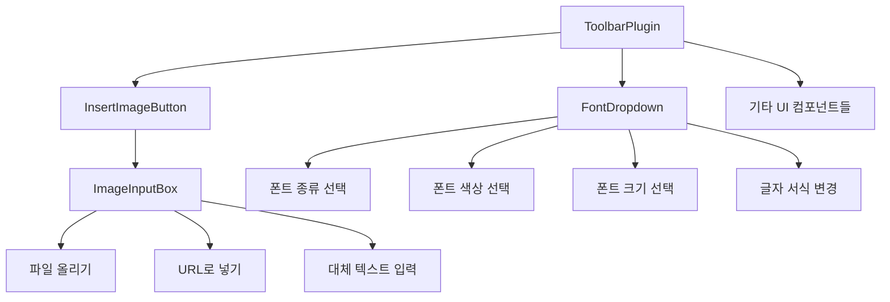
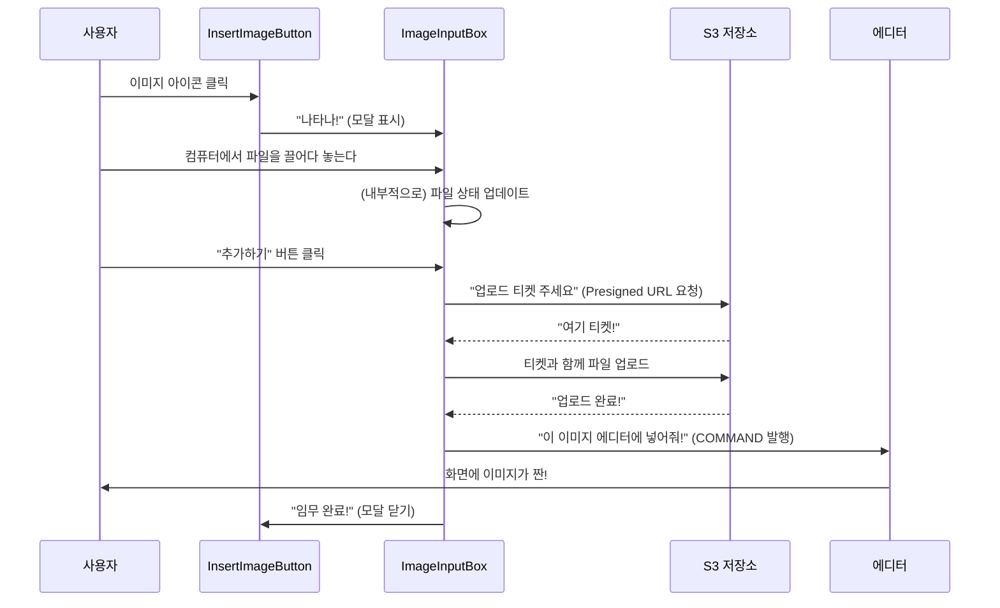

-----

# PostEditor 툴바 조립하기: Segments 컴포넌트 시스템 🛠️

## 시작하며

PostEditor의 심장부가 '플러그인'이라면, 유저와 직접 만나는 얼굴은 '툴바'겠죠. 이 툴바는 어떻게 만들어져 있을까요? 거대한 하나의 컴포넌트가 아니라, 작고 전문화된 UI 조각들, 즉 **세그먼트(Segment) 컴포넌트**들을 조립해서 만들었습니다.

`segments` 디렉토리에는 바로 이 UI 레고 블록들이 들어있어요. 폰트 설정, 이미지 추가 버튼 등 각자의 역할이 명확한 재사용 가능한 컴포넌트들이죠. 이번 문서에서는 이 세그먼트들이 어떻게 설계되었고, 서로 어떻게 맞물려 돌아가는지 알아보겠습니다.

-----

## 목차

- [어떤 생각으로 만들었을까? (설계 철학)](https://www.google.com/search?q=%23%EC%96%B4%EB%96%A4-%EC%83%9D%EA%B0%81%EC%9C%BC%EB%A1%9C-%EB%A7%8C%EB%93%A4%EC%97%88%EC%9D%84%EA%B9%8C-%EC%84%A4%EA%B3%84-%EC%B2%A0%ED%95%99)
- [툴바의 부품들, 하나씩 살펴보기](https://www.google.com/search?q=%23%ED%88%B4%EB%B0%94%EC%9D%98-%EB%B6%80%ED%92%88%EB%93%A4-%ED%95%98%EB%82%98%EC%94%A9-%EC%82%B4%ED%8E%B4%EB%B3%B4%EA%B8%B0)
  - [1. FontDropdown: 폰트 꾸미기의 모든 것](https://www.google.com/search?q=%231-fontdropdown-%ED%8F%B0%ED%8A%B8-%EA%BE%B8%EB%AF%B8%EA%B8%B0%EC%9D%98-%EB%AA%A8%EB%93%A0-%EA%B2%83)
  - [2. InsertImageButton: 이미지 추가의 시작점](https://www.google.com/search?q=%232-insertimagebutton-%EC%9D%B4%EB%AF%B8%EC%A7%80-%EC%B6%94%EA%B0%80%EC%9D%98-%EC%8B%9C%EC%9E%91%EC%A0%90)
  - [3. ImageInputBox: 똑똑한 이미지 업로더](https://www.google.com/search?q=%233-imageinputbox-%EB%98%91%EB%98%91%ED%95%9C-%EC%9D%B4%EB%AF%B8%EC%A7%80-%EC%97%85%EB%A1%9C%EB%8D%94)
  - [4. ToggleButton: 만능 스위치 (예정)](https://www.google.com/search?q=%234-togglebutton-%EB%A7%8C%EB%8A%A5-%EC%8A%A4%EC%9C%84%EC%B9%98-%EC%98%88%EC%A0%95)
- [좋은 UI를 만드는 우리만의 원칙](https://www.google.com/search?q=%23%EC%A2%8B%EC%9D%80-ui%EB%A5%BC-%EB%A7%8C%EB%93%9C%EB%8A%94-%EC%9A%B0%EB%A6%AC%EB%A7%8C%EC%9D%98-%EC%9B%90%EC%B9%99)
- [사용자 경험 시나리오 (상호 작용)](https://www.google.com/search?q=%23%EC%82%AC%EC%9A%A9%EC%9E%90-%EA%B2%BD%ED%97%98-%EC%8B%9C%EB%82%98%EB%A6%AC%EC%98%A4-%EC%83%81%ED%98%B8-%EC%9E%91%EC%9A%A9)
- [빠릿한 UI를 위한 노력들](https://www.google.com/search?q=%23%EB%B9%A0%EB%A6%BF%ED%95%9C-ui%EB%A5%BC-%EC%9C%84%ED%95%9C-%EB%85%B8%EB%A0%A5%EB%93%A4)
- [미래를 생각하는 설계](https://www.google.com/search?q=%23%EB%AF%B8%EB%9E%98%EB%A5%BC-%EC%83%9D%EA%B0%81%ED%95%98%EB%8A%94-%EC%84%A4%EA%B3%84)

-----

## 🤔 어떤 생각으로 만들었을까? (설계 철학)

세그먼트 컴포넌트들의 핵심 설계 철학은 \*\*"하나의 컴포넌트는 한 가지 일만 잘하자"\*\*는 \*\*단일 책임 원칙(SRP)\*\*입니다. 툴바라는 큰 기능을 잘게 쪼개서 각 부품이 자신의 역할에만 집중하게 만들었죠.



이렇게 하면 `FontDropdown`은 폰트 걱정만, `InsertImageButton`은 이미지 추가 걱정만 하면 되니 코드가 훨씬 깔끔해지고 관리하기도 쉬워져요.

-----

## 🔩 툴바의 부품들, 하나씩 살펴보기

### 1\. FontDropdown: 폰트 꾸미기의 모든 것

**파일**: `FontDropdown.tsx`  
**역할**: 폰트 종류, 크기, 색상, 스타일 등 글자를 꾸미는 데 필요한 모든 기능을 한데 모아놓은 컨트롤 타워예요.

#### 속 들여다보기

**1. 다양한 폰트 옵션 제공**
유저가 고를 수 있는 폰트 목록과 색상 팔레트를 미리 정의해두고, 선택된 옵션을 화면에 보여줘요. 한글 폰트 이름('프리텐다드')을 내부적으로는 영문('Pretendard')으로 처리하는 작은 디테일도 숨어있죠.

```typescript
// 유저에게 보여줄 폰트 목록
const FONT_FAMILY_OPTIONS: [string, string][] = [
  ['Pretendard', '프리텐다드'], // [CSS 값, 표시 이름]
  ['Arial', 'Arial'],
];

// 유저에게 보여줄 색상 목록
const FONT_COLOR_OPTIONS: string[] = [ '#000', '#3C42E0', ... ];
```

**2. 직관적인 텍스트 서식 버튼**
'굵게', '기울임' 같은 서식 버튼들은 현재 텍스트 상태에 따라 활성화 여부(`isHighlighted`)가 바뀌어요. 상위/하위 첨자처럼 아이콘으로 표현하기 어려운 기능은 재치있게 텍스트로 구현했죠.

```typescript
<TextFormatButton
  onClick={dispatchTextFormat('bold')}
  isHighlighted={isBold}
>
  B
</TextFormatButton>
```

**3. Lexical과 소통하기**
유저가 폰트 크기나 색상을 바꾸면, `editor.update` 안에서 Lexical이 제공하는 `$patchStyleText` API를 호출해 에디터에 즉시 스타일을 적용해요.

```typescript
const onClick = useCallback((style: string, option: string) => {
    editor.update(() => {
        const selection = $getSelection();
        if (selection !== null) {
          // 선택된 텍스트에 스타일을 입혀줘!
          $patchStyleText(selection, { [style]: option });
        }
    });
  }, [editor]);
```

> **왜 만들었을까?** 흩어지기 쉬운 폰트 관련 기능들을 한곳에 모아 사용자에게 통합된 경험을 주고, 모바일에서도 쓰기 편하도록 반응형으로 설계했어요.

-----

### 2\. InsertImageButton: 이미지 추가의 시작점

**파일**: `InsertImageButton.tsx`  
**역할**: 이미지 아이콘 버튼 그 자체와, 버튼을 눌렀을 때 나타나는 이미지 입력창(`ImageInputBox`)을 띄우고 관리하는 역할을 해요.

#### 속 들여다보기

**1. React Portal로 z-index 전쟁 종식\!**
이미지 입력창 같은 모달(modal)은 종종 다른 UI에 가려지는 `z-index` 문제가 생기곤 하죠. `createPortal`을 사용해 모달을 DOM 트리의 최상단(`document.body`)으로 순간이동시켜서 이런 문제를 원천 봉쇄했어요.

```typescript
return (
  <>
    <button ref={buttonRef} onClick={() => setShowImageInsertBox(true)}>...</button>
    {showImageInsertBox &&
      createPortal( // ImageInputBox를 document.body로 텔레포트!
        <ImageInputBox ... />,
        document.body
      )}
  </>
);
```

**2. 모달 위치는 동적으로 계산**
버튼을 기준으로 모달의 위치(`top`, `left`)를 동적으로 계산해서, 화면 어디에 있든 항상 버튼 바로 아래에 예쁘게 나타나도록 했어요.

**3. 바깥을 누르면 닫히는 편리함**
모달이 열렸을 때 `document`에 클릭 이벤트를 걸어두고, 만약 클릭된 곳이 모달 영역 바깥이라면 모달을 닫아주는 흔하지만 아주 편리한 UX를 구현했어요.

> **왜 만들었을까?** 이미지 추가 기능의 '관문' 역할을 하면서, 모달 관리의 복잡한 로직(위치 계산, 외부 클릭 감지, Portal 렌더링)을 도맡아 처리해요. 덕분에 `ToolbarPlugin`은 "이 버튼 그냥 보여줘" 하기만 하면 되죠.

-----

### 3\. ImageInputBox: 똑똑한 이미지 업로더

**파일**: `ImageInputBox.tsx`  
**역할**: `InsertImageButton`이 띄워주는 바로 그 모달창. 유저가 다양한 방식으로 이미지를 올리고, 설정을 마칠 수 있는 종합 인터페이스예요.

#### 속 들여다보기

**1. 세 가지 업로드 방식 지원**
사용자 편의를 위해 파일 직접 선택, URL 입력, 드래그 앤 드롭까지 세 가지 이미지 입력 방식을 모두 지원해요. 하나의 방식이 활성화되면 다른 방식은 비활성화해서 혼동을 줄였죠.

**2. 안전한 S3 업로드 (Presigned URL)**
이미지를 우리 서버를 거쳐 S3에 올리면 비효율적이고 보안에도 좋지 않아요. 그래서 **Presigned URL** 방식을 사용해요.

1.  우리 서버에 "이 파일 S3에 올려도 돼?" 하고 물어보면,
2.  서버가 "응, 이 티켓(Presigned URL) 가지고 10분 안에 직접 올려." 하고 1회용 업로드 티켓을 줘요.
3.  브라우저는 그 티켓을 가지고 S3에 직접 파일을 안전하게 업로드해요.

<!-- end list -->

```typescript
const uploadToS3 = async (file: File) => {
  // 1. 우리 서버에 1회용 업로드 티켓(Presigned URL) 요청
  const data = await requestPresignedUrl(...);
  // 2. 받은 티켓으로 S3에 직접 파일 업로드
  await toS3({ url: data.presignedUrl, ... });
  return data.presignedUrl;
};
```

> **왜 만들었을까?** 복잡한 이미지 업로드 과정을 하나의 컴포넌트에 캡슐화했어요. 파일 상태 관리, UI 피드백, 안전한 S3 통신까지 이미지 업로드에 관한 모든 책임을 이 컴포넌트가 짊어집니다.

-----

### 4\. ToggleButton: 만능 스위치 (예정)

**파일**: `ToggleButton.tsx`  
**역할**: 켜고 끄는 기능이 필요한 모든 곳에 쓸 수 있는 범용 토글 버튼이에요. (현재는 비어있지만, 이렇게 만들 수 있겠죠?)

#### 미래의 모습

```typescript
// 이런 모습으로 완성될 수 있어요
export const ToggleButton: React.FC<{
  isToggled: boolean; // 켜졌는지?
  onToggle: () => void; // 누르면 뭘 할지?
  children: ReactNode; // 버튼 안에 들어갈 내용
}> = ({ isToggled, onToggle, children }) => {
  return (
    <StyledToggleButton onClick={onToggle} isToggled={isToggled}>
      {children}
    </StyledToggleButton>
  );
};
```

> **왜 만들까?** 에디터 곳곳에 필요한 간단한 'ON/OFF' 스위치 역할을 할 재사용성 높은 부품으로 설계될 예정이에요.

-----

## ✨ 좋은 UI를 만드는 우리만의 원칙

### 1\. 작은 블록으로 조립하기 (컴포지션)

큰 `ToolbarPlugin`을 `FontDropdown`, `InsertImageButton` 같은 작은 부품으로 나눠 조립했어요. 이렇게 하면 각 부품을 독립적으로 수정하거나 교체하기 쉬워져요.

### 2\. 부모가 시키는 대로 (제어 역전, IoC)

`InsertImageButton`은 이미지를 어떻게 에디터에 넣을지 몰라요. 그저 부모(`ToolbarPlugin`)가 "이미지 준비되면 이 함수(`insertImage`) 실행해\!" 하고 넘겨준 일을 할 뿐이죠. 이렇게 역할을 분리하면 `InsertImageButton`은 어떤 부모 밑에서도 일할 수 있는 재사용성 높은 부품이 돼요.

-----

## 💬 사용자 경험 시나리오 (상호 작용)

### 유저가 이미지를 추가하는 과정



-----

## 🚀 빠릿한 UI를 위한 노력들

* **기억하기 (`useCallback`)**: 불필요한 함수 생성을 막아 렌더링 성능을 아껴요.
* **필요할 때만 그리기 (조건부 렌더링)**: 이미지 입력창은 버튼을 눌렀을 때만 렌더링해서 초기 로딩 부담을 줄여요.
* **깔끔한 뒷정리**: 모달이 닫힐 때 이벤트 리스너를 깨끗하게 제거해서 메모리 누수를 막아요.

-----

## 🌐 미래를 생각하는 설계

### 1\. 유연한 인터페이스 (Props)

`InsertImageButton`의 `buttonLabel` prop에 텍스트를 주든, 아이콘 컴포넌트를 주든 뭐든지 받을 수 있게 `ReactNode` 타입으로 만들었어요. 덕분에 다양한 모습으로 재사용할 수 있죠.

### 2\. 새로운 블록 추가하기

만약 툴바에 '비디오 추가'나 '표 추가' 버튼이 필요해진다면? `InsertVideoButton` 같은 새로운 세그먼트 컴포넌트를 만들어 `ToolbarPlugin`에 쏙 끼워넣기만 하면 돼요. 기존 코드는 거의 건드릴 필요가 없죠.

-----

## 결론

PostEditor의 `segments`는 \*\*"복잡한 UI를 작고, 독립적이고, 재사용 가능한 부품들로 조립한다"\*\*는 생각으로 설계되었어요.

* **하나의 부품은 하나의 기능만** (단일 책임)
* **부품을 조립해 완성품을** (컴포지션)
* **부품은 부모가 시키는 일만** (제어 역전)

이런 원칙들 덕분에 PostEditor의 UI는 일관성을 유지하면서도, 앞으로 새로운 기능을 추가하거나 기존 기능을 수정하기 아주 좋은 유연한 구조를 갖게 되었습니다. 결국 이 작은 세그먼트들이 모여 PostEditor의 전체적인 **사용자 경험**을 완성하는 셈이죠.